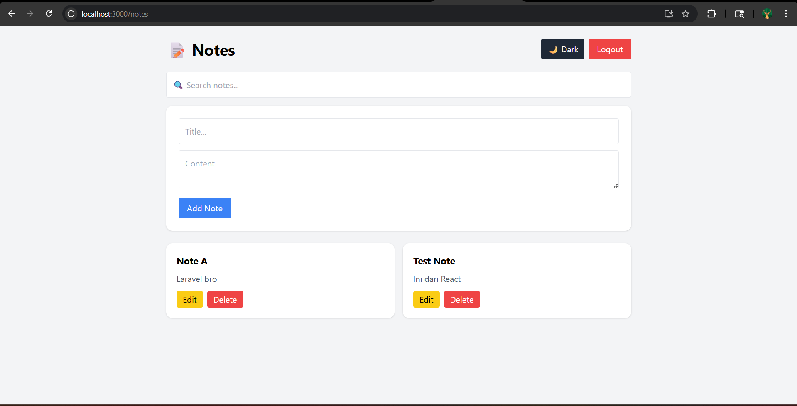
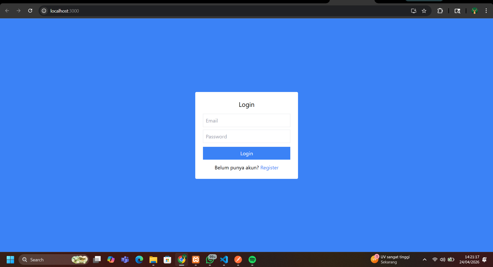
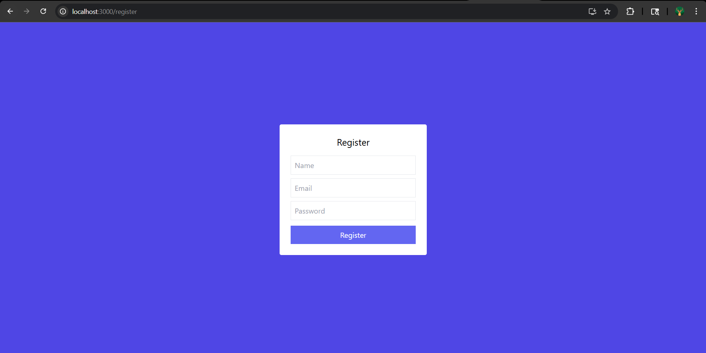

# 📝 Fullstack Notes App

A simple fullstack notes application built with:

- React (Frontend)
- Laravel (Backend API)
- Tailwind CSS (UI)

## 🚀 Features

- Register & Login
- CRUD Notes
- Dark Mode
- Search Notes

## 🧱 Structure

notes-client → React app  
notes-api → Laravel API  

## ⚙️ Setup

### Backend
cd notes-api  
composer install  
php artisan migrate  
php artisan serve  

### Frontend
cd notes-client  
npm install  
npm start  

## 📸 Preview

### 📝 Notes Page

### 🔐 Login Page

### 🆕 Register Page

## 👨‍💻 Author

Ilham Ar-rosyid